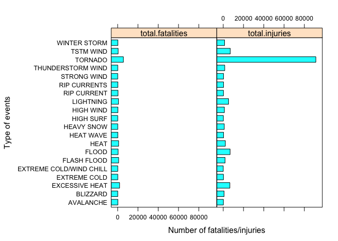

# Storm Impact Analysis in the US

# Synopsis

This reports looks at the impact of storm events across the United States 
between the year 1950 and Novermber 2011. In particular, it considers the cost 
of these storm events both to population health and the economy. The analysis 
will show that the top 3 events that have been the most harmful to population 
health are _TORNADO_, _EXCESSIVE HEAT_ and _FLASH FLOOD_ taking into
account the number of fatalities and injuries caused by each event type. 
Tornado caused the most harm with 5633 fatalities and 91346 injuries.
Also, the top 3 events that have had the greatest economic consequences are 
_FLOOD_, _HURRICANE/TYPHOON_ and _TORNADO_ considering the cost (in dollars) of
damages to properties and crops.


# Data Processing
So as to ascertain the most harmful events with respect to population health, 
this report considered the following variables

-  the type of event (indicated in the EVTYPE variable)
-  number of deaths caused by an event (indicated in FATALITIES variable)
-  number of injuries caused by an event (indicated in INJURIES variable)

So as to ascertain the events that resulted in the gravest economic impact, the
following report took into account

- the type of event indicated in the EVTYPE variable
- dollar estimate of damage to properties indicated in the "PROPDMG" variable
- magnitude of damage estimate to properties indicated in the "PROPDMGEXP" variable
- dollar estimate of damage to properties indicated in the "CROPDMG" variable
- magnitude of damage estimate to properties indicated in the "CROPDMGEXP" variable

### Tidy up data

The variables mentioned above are extracted and cleaned up to allow further 
analysis required to answer the questions this report aims to address.


```r
storm <- read.csv('~/work/R/coursera/repdata-012/PeerAssessment2/StormData.csv')

# Extract relevant variables needed for computation
extract <- storm[,c("EVTYPE", "FATALITIES", "INJURIES", "PROPDMG", "PROPDMGEXP", "CROPDMG", "CROPDMGEXP")]

# Tidy up PROPDMGEXP and CROPDMGEXP variables to take care of the various 
# representation of magnitude of damage estimate.
# (""  "-" "?" "+" "0" "1" "2" "3" "4" "5" "6" "7" "8" "B" "h" "H" "K" "m" "M")
tidyExpData <- function(x) {
    x <- as.character(x)
    x[x == ''] <- 0
    x[(x == 'h') | (x == 'H')] <- 2
    x[(x == 'k') | (x == 'K')] <- 3
    x[(x == 'm') | (x == 'M')] <- 6
    x[(x == 'b') | (x == 'B')] <- 9
    x[(x == '-') | (x == '+') | (x == '?')] <- 1
    x 
}

extract$PROPDMGExpValue <- tidyExpData(extract$PROPDMGEXP)
extract$CROPDMGExpValue <- tidyExpData(extract$CROPDMGEXP)
```


-   Assuming most harmful events with respect to population health are events 
    that caused fatalities or injuries, let us compute the total number of 
    fatalities and/or injuries per event type.
    

```r
library(plyr)
# Compute total number of fatalities and injuries per event type
evHarmAgg <- ddply(extract, "EVTYPE", summarise, 
                   total.fatalities = sum(FATALITIES), 
                   total.injuries = sum(INJURIES))

# Get a subset of events that caused fatalities or injuries
evHarm <- evHarmAgg[evHarmAgg$total.fatalities > 0 | evHarmAgg$total.injuries > 0, ]
evHarm <- evHarm[order(evHarm$total.fatalities, evHarm$total.injuries, decreasing=T), ]
```


-   Taking into account the PROPDMG, PROPDMGEXP, CROPDMG and CROPDMGEXP variables,
    let us compute the cost (in dollars) of damages to properties and crops per 
    event type


```r
library(plyr)
# Compute cost of damages to properties
extract$PROPDMGCOST <- extract$PROPDMG * 10^as.numeric(extract$PROPDMGExpValue)

# Compute cost of damages to crops
extract$CROPDMGCOST <- extract$CROPDMG * 10^as.numeric(extract$CROPDMGExpValue)

# Compute total cost of damages to properties and crops per event type
evCostAgg <- ddply(extract, "EVTYPE", summarise,
                   total.propdmgcost = sum(PROPDMGCOST),
                   total.cropdmgcost = sum(CROPDMGCOST))

# Get a subset of events that caused damages to properties and/or crops
evCost <- evCostAgg[evCostAgg$total.propdmgcost > 0 | evCostAgg$total.cropdmgcost > 0, ]
evCost <- evCost[order(evCost$total.propdmgcost, evCost$total.cropdmgcost, decreasing=T), ]
```

# Results
## Most harmful events with respect to population health

This section answers the question:

> Across the United States, which types of events (as indicated in the EVTYPE 
  variable) are most harmful with respect to population health?
    

```r
# Top 20 most harmful events with respect to population health
evHarm20 <- head(evHarm, 20)
evHarm20 
```

```
##                      EVTYPE total.fatalities total.injuries
## 834                 TORNADO             5633          91346
## 130          EXCESSIVE HEAT             1903           6525
## 153             FLASH FLOOD              978           1777
## 275                    HEAT              937           2100
## 464               LIGHTNING              816           5230
## 856               TSTM WIND              504           6957
## 170                   FLOOD              470           6789
## 585             RIP CURRENT              368            232
## 359               HIGH WIND              248           1137
## 19                AVALANCHE              224            170
## 972            WINTER STORM              206           1321
## 586            RIP CURRENTS              204            297
## 278               HEAT WAVE              172            309
## 140            EXTREME COLD              160            231
## 760       THUNDERSTORM WIND              133           1488
## 310              HEAVY SNOW              127           1021
## 141 EXTREME COLD/WIND CHILL              125             24
## 676             STRONG WIND              103            280
## 30                 BLIZZARD              101            805
## 350               HIGH SURF              101            152
```

```r
# Number of most harmful events
length(evHarm$EVTYPE)
```

```
## [1] 220
```

```r
# Total number of event types
length(evHarmAgg$EVTYPE)
```

```
## [1] 985
```

From the results of analysis carried out, it can be observed that:

-   out of the 985 event types in the data set
    220 were the most harmful to  human population health
    in the US.
-   The top 5 most harmful events includes 
    + TORNADO, EXCESSIVE HEAT, FLASH FLOOD, HEAT, LIGHTNING
    
A complete list of the most harmful events with respect to population health are
can be seen in the Appendix section below.

**Plot of the 20 most harmful events**


```r
library(reshape2)
evHarm20Melt <- melt(evHarm20, id=c('EVTYPE'), 
                     measure.vars=c('total.fatalities', 'total.injuries'))

library(lattice)
barchart(EVTYPE ~ value | variable, data = evHarm20Melt,
         xlab = 'Number of fatalities/injuries',
         ylab = 'Type of events')
```

 


## Economic consequences

This section addresses the question:

> Across the United States, which types of events have the greatest economic 
  consequences?


```r
# Top 20 most harmful events
evCost20 <- head(evCost, 20)
evCost20
```

```
##                        EVTYPE total.propdmgcost total.cropdmgcost
## 170                     FLOOD      144657709807        5661968450
## 411         HURRICANE/TYPHOON       69305840000        2607872800
## 834                   TORNADO       56947381216         414953270
## 670               STORM SURGE       43323536000              5000
## 153               FLASH FLOOD       16822673978        1421317100
## 244                      HAIL       15735267513        3025954473
## 402                 HURRICANE       11868319010        2741910000
## 848            TROPICAL STORM        7703890550         678346000
## 972              WINTER STORM        6688497251          26944000
## 359                 HIGH WIND        5270046610         638571300
## 590               RIVER FLOOD        5118945500        5029459000
## 957                  WILDFIRE        4765114000         295472800
## 671          STORM SURGE/TIDE        4641188000            850000
## 856                 TSTM WIND        4484928495         554007350
## 427                 ICE STORM        3944927860        5022113500
## 760         THUNDERSTORM WIND        3483122472         414843050
## 408            HURRICANE OPAL        3172846000          19000000
## 955          WILD/FOREST FIRE        3001829500         106796830
## 299 HEAVY RAIN/SEVERE WEATHER        2500000000                 0
## 786        THUNDERSTORM WINDS        1944590859         190654788
```

From the results computed above, which took into account the cost of damage to
both properties and crops, it can be seen that the top 5 events that have the
greatest economic consequences includes 

- FLOOD, HURRICANE/TYPHOON, TORNADO, STORM SURGE, FLASH FLOOD.

**Plot of the events that caused the greatest economic consequence**


```r
library(reshape2)
evCost20Melt <- melt(evCost20, id=c('EVTYPE'), 
                     measure.vars=c('total.propdmgcost', 'total.cropdmgcost'))
barchart(EVTYPE ~ value | variable, data = evCost20Melt,
         xlab = 'Cost of damage to properties and crops',
         ylab = 'Type of events')
```

 


# Appendix


```r
# List of most harmful events
as.character(evHarm$EVTYPE)
```

```
##   [1] "TORNADO"                        "EXCESSIVE HEAT"                
##   [3] "FLASH FLOOD"                    "HEAT"                          
##   [5] "LIGHTNING"                      "TSTM WIND"                     
##   [7] "FLOOD"                          "RIP CURRENT"                   
##   [9] "HIGH WIND"                      "AVALANCHE"                     
##  [11] "WINTER STORM"                   "RIP CURRENTS"                  
##  [13] "HEAT WAVE"                      "EXTREME COLD"                  
##  [15] "THUNDERSTORM WIND"              "HEAVY SNOW"                    
##  [17] "EXTREME COLD/WIND CHILL"        "STRONG WIND"                   
##  [19] "BLIZZARD"                       "HIGH SURF"                     
##  [21] "HEAVY RAIN"                     "EXTREME HEAT"                  
##  [23] "COLD/WIND CHILL"                "ICE STORM"                     
##  [25] "WILDFIRE"                       "HURRICANE/TYPHOON"             
##  [27] "THUNDERSTORM WINDS"             "FOG"                           
##  [29] "HURRICANE"                      "TROPICAL STORM"                
##  [31] "HEAVY SURF/HIGH SURF"           "LANDSLIDE"                     
##  [33] "HIGH WINDS"                     "COLD"                          
##  [35] "WINTER WEATHER"                 "TSUNAMI"                       
##  [37] "UNSEASONABLY WARM AND DRY"      "URBAN/SML STREAM FLD"          
##  [39] "WINTER WEATHER/MIX"             "TORNADOES, TSTM WIND, HAIL"    
##  [41] "WIND"                           "DUST STORM"                    
##  [43] "FLASH FLOODING"                 "DENSE FOG"                     
##  [45] "FLOOD/FLASH FLOOD"              "EXTREME WINDCHILL"             
##  [47] "RECORD/EXCESSIVE HEAT"          "HAIL"                          
##  [49] "MARINE STRONG WIND"             "COLD AND SNOW"                 
##  [51] "FLASH FLOOD/FLOOD"              "STORM SURGE"                   
##  [53] "WILD/FOREST FIRE"               "UNSEASONABLY WARM"             
##  [55] "STORM SURGE/TIDE"               "MARINE THUNDERSTORM WIND"      
##  [57] "WINTER STORMS"                  "MARINE TSTM WIND"              
##  [59] "TROPICAL STORM GORDON"          "ROUGH SEAS"                    
##  [61] "GLAZE"                          "HEAVY SURF"                    
##  [63] "FREEZING RAIN"                  "STRONG WINDS"                  
##  [65] "MARINE MISHAP"                  "LOW TEMPERATURE"               
##  [67] "ICE"                            "FLOODING"                      
##  [69] "HURRICANE ERIN"                 "TSTM WIND/HAIL"                
##  [71] "ICY ROADS"                      "SNOW"                          
##  [73] "HIGH SEAS"                      "COLD WEATHER"                  
##  [75] "FLASH FLOODING/FLOOD"           "HEAT WAVES"                    
##  [77] "RIP CURRENTS/HEAVY SURF"        "HEAT WAVE DROUGHT"             
##  [79] "GUSTY WINDS"                    "Mudslide"                      
##  [81] "RAIN/SNOW"                      "ROUGH SURF"                    
##  [83] "SNOW AND ICE"                   "HIGH WIND/SEAS"                
##  [85] "Hypothermia/Exposure"           "WILD FIRES"                    
##  [87] "WATERSPOUT/TORNADO"             "WATERSPOUT"                    
##  [89] "DRY MICROBURST"                 "HIGH WIND AND SEAS"            
##  [91] "HIGH WINDS/SNOW"                "High Surf"                     
##  [93] "COASTAL FLOOD"                  "COASTAL STORM"                 
##  [95] "Cold"                           "COLD WAVE"                     
##  [97] "HEAVY SEAS"                     "Heavy surf and wind"           
##  [99] "HIGH WATER"                     "HYPOTHERMIA/EXPOSURE"          
## [101] "RECORD HEAT"                    "DUST DEVIL"                    
## [103] "SNOW SQUALL"                    "MIXED PRECIP"                  
## [105] "EXCESSIVE RAINFALL"             "FREEZING DRIZZLE"              
## [107] "RIVER FLOOD"                    "Coastal Flooding"              
## [109] "Cold Temperature"               "DROUGHT/EXCESSIVE HEAT"        
## [111] "Extreme Cold"                   "FLASH FLOODS"                  
## [113] "HEAVY SNOW AND HIGH WINDS"      "HURRICANE OPAL/HIGH WINDS"     
## [115] "RIVER FLOODING"                 "SLEET"                         
## [117] "UNSEASONABLY COLD"              "WINTRY MIX"                    
## [119] "BLACK ICE"                      "WINTER STORM HIGH WINDS"       
## [121] "BLOWING SNOW"                   "THUNDERSTORM"                  
## [123] "FROST"                          "LIGHT SNOW"                    
## [125] "Marine Accident"                "blowing snow"                  
## [127] "FALLING SNOW/ICE"               "FOG AND COLD TEMPERATURES"     
## [129] "GUSTY WIND"                     "HURRICANE OPAL"                
## [131] "LANDSLIDES"                     "MARINE HIGH WIND"              
## [133] "THUNDERSNOW"                    "WINDS"                         
## [135] "AVALANCE"                       "COASTAL FLOODING"              
## [137] "COASTALSTORM"                   "COLD/WINDS"                    
## [139] "DROWNING"                       "Extended Cold"                 
## [141] "FLOOD & HEAVY RAIN"             "FLOOD/RIVER FLOOD"             
## [143] "FREEZE"                         "FREEZING RAIN/SNOW"            
## [145] "Freezing Spray"                 "Heavy Surf"                    
## [147] "HIGH SWELLS"                    "HIGH WAVES"                    
## [149] "HURRICANE FELIX"                "HYPERTHERMIA/EXPOSURE"         
## [151] "HYPOTHERMIA"                    "ICE ON ROAD"                   
## [153] "LIGHTNING."                     "MINOR FLOODING"                
## [155] "Mudslides"                      "RAIN/WIND"                     
## [157] "RAPIDLY RISING WATER"           "RECORD COLD"                   
## [159] "Snow Squalls"                   "SNOW/ BITTER COLD"             
## [161] "Strong Winds"                   "THUNDERSTORM WIND (G40)"       
## [163] "THUNDERSTORM WIND G52"          "THUNDERTORM WINDS"             
## [165] "TSTM WIND (G35)"                "URBAN AND SMALL STREAM FLOODIN"
## [167] "Whirlwind"                      "WIND STORM"                    
## [169] "Heat Wave"                      "WINTER WEATHER MIX"            
## [171] "SNOW/HIGH WINDS"                "THUNDERSTORMW"                 
## [173] "TORNADO F2"                     "GLAZE/ICE STORM"               
## [175] "HEAVY SNOW/ICE"                 "SMALL HAIL"                    
## [177] "THUNDERSTORM  WINDS"            "NON-SEVERE WIND DAMAGE"        
## [179] "COASTAL FLOODING/EROSION"       "TYPHOON"                       
## [181] "DROUGHT"                        "HEAVY RAINS"                   
## [183] "HIGH WINDS/COLD"                "OTHER"                         
## [185] "THUNDERSTORM WINDSS"            "Torrential Rainfall"           
## [187] "FUNNEL CLOUD"                   "TSTM WIND (G45)"               
## [189] "BRUSH FIRE"                     "EXCESSIVE SNOW"                
## [191] "Gusty winds"                    "Heavy snow shower"             
## [193] "Hurricane Edouard"              "HURRICANE-GENERATED SWELLS"    
## [195] "ICE STORM/FLASH FLOOD"          "ROGUE WAVE"                    
## [197] "Snow"                           "TORNADO F3"                    
## [199] "WARM WEATHER"                   "Coastal Storm"                 
## [201] "DRY MIRCOBURST WINDS"           "Dust Devil"                    
## [203] "Gusty Winds"                    "HAZARDOUS SURF"                
## [205] "HEAVY SNOW/BLIZZARD/AVALANCHE"  "HIGH"                          
## [207] "HIGH WIND 48"                   "HIGH WIND/HEAVY SNOW"          
## [209] "HURRICANE EMILY"                "ICE ROADS"                     
## [211] "LIGHTNING AND THUNDERSTORM WIN" "LIGHTNING INJURY"              
## [213] "NON TSTM WIND"                  "River Flooding"                
## [215] "THUNDERSTORM WINDS 13"          "THUNDERSTORM WINDS/HAIL"       
## [217] "THUNDERSTORMS WINDS"            "TIDAL FLOODING"                
## [219] "TSTM WIND (G40)"                "WATERSPOUT TORNADO"
```
